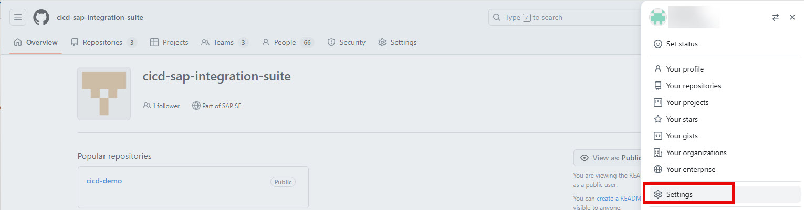
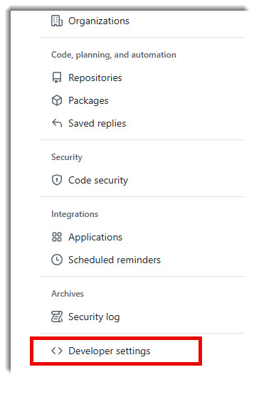
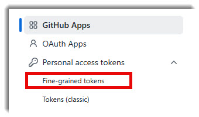
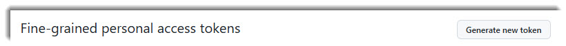
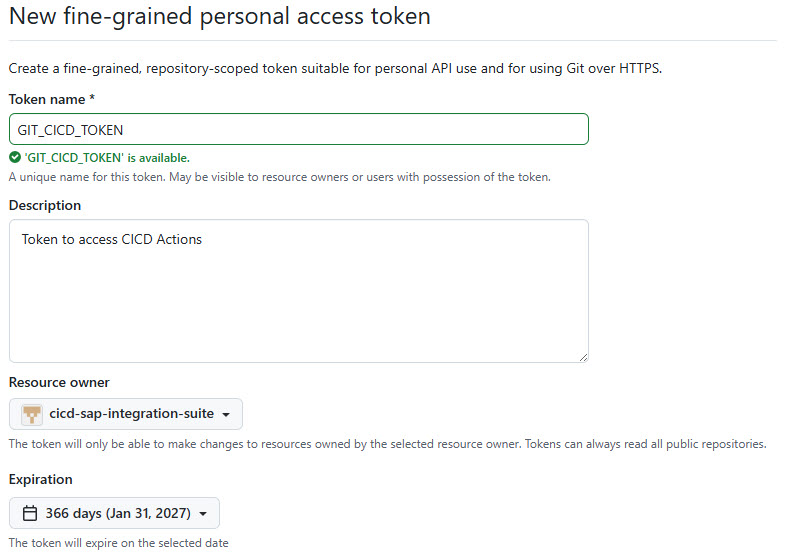
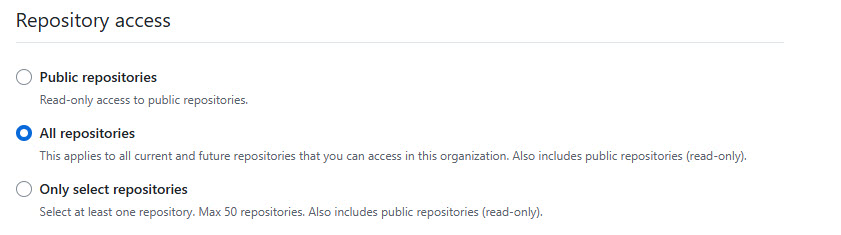
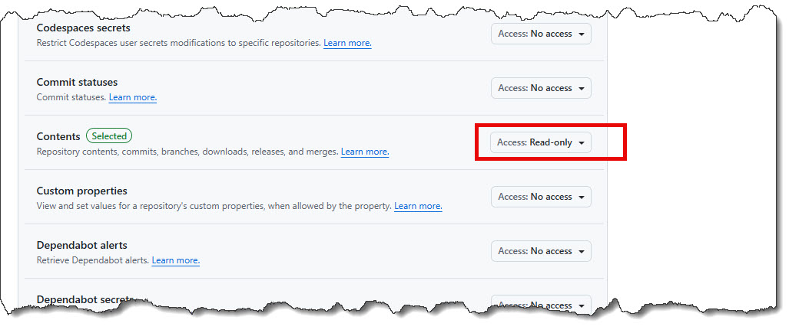
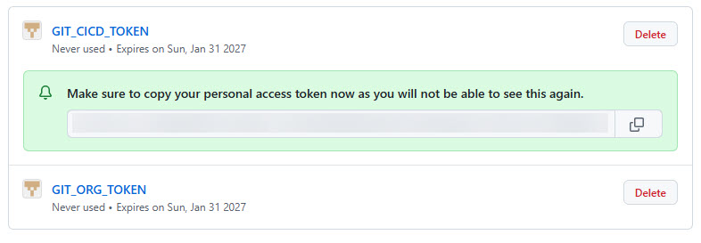

# Create CICD Token

Another Token is required to allow downloading the source from repository cicd-actions

Perform the following steps to create CICD Token

Open the organization where repository cicd-actions is located and open your user settings

## Step-by-Step Instructions

### 1. Access Organization Settings

Navigate to your GitHub Organization and open **Settings** from your user menu.

---

### 2. Open Developer Settings

Scroll to the bottom of the settings page and select **Developer Settings**.

---

### 3. Select Fine-Grained Tokens

Under **Personal Access Tokens**, select **Fine-grained tokens**.

---

### 4. Generate a New Token

Click **Generate new token**.

---

### 5. Configure Token Settings

Fill in the required token information.

> ⚠️ **Important:** Make sure to select the correct **Organization** as the resource owner.

> 💡 **Note:** The token access settings shown in the screenshots above are only suggestions. You can adjust the permissions based on your organization's security requirements.

---

### 6. Save Your Token

After generating the token, **copy and store it securely** (e.g., in a password manager like KeePass).

> ⚠️ **Warning:** The token will only be displayed once. If you lose it, you will need to generate a new one.

---

