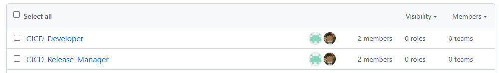
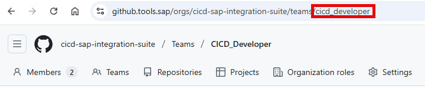
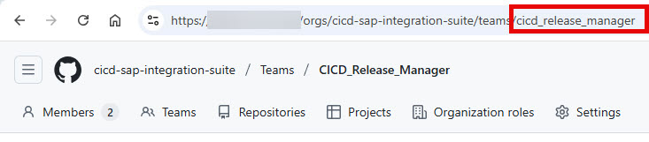

# Create Organizational Teams

To ensure secure and efficient management of your CI/CD workflows, it is essential to organize your GitHub teams appropriately. Team-based authorization allows you to control who can execute specific workflows.

**Required Teams:**
- **Developers Team** (e.g., `cicd_developer`): Assign all developers who will contribute content and run developer-level workflows.
- **Release Managers/Admins Team** (e.g., `cicd_release_manager`): Assign users responsible for releases, approvals, and administrative tasks. This team will have access to workflows requiring higher privileges.

You can always change team assignments later as your organization evolves.

By structuring your teams this way, you can clearly separate responsibilities and ensure that only authorized users can perform sensitive operations.

**How to Create Teams:**
1. Navigate to your GitHub Organization.
2. Go to the **Teams** tab.
3. Create the two teams as described above (names are only examples) and assign the appropriate members.

The screenshot below shows where to find the Teams tab in your GitHub Organization:

Create teams and assign the users (you can always change assignment later on)

Click on each team and remember the "slug" (URL-safe, lowercase identifier) of both teams

Here → cicd_developer

and → cicd_release_manager

