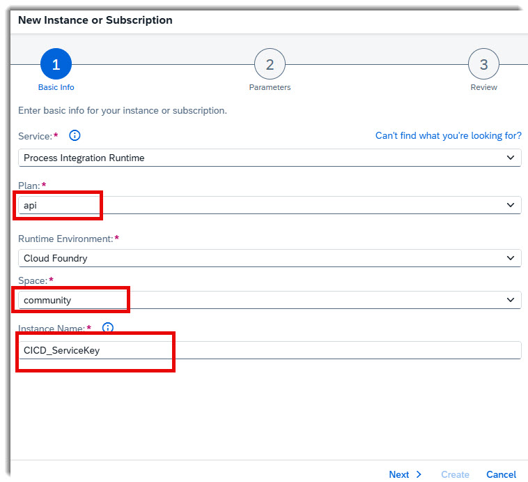
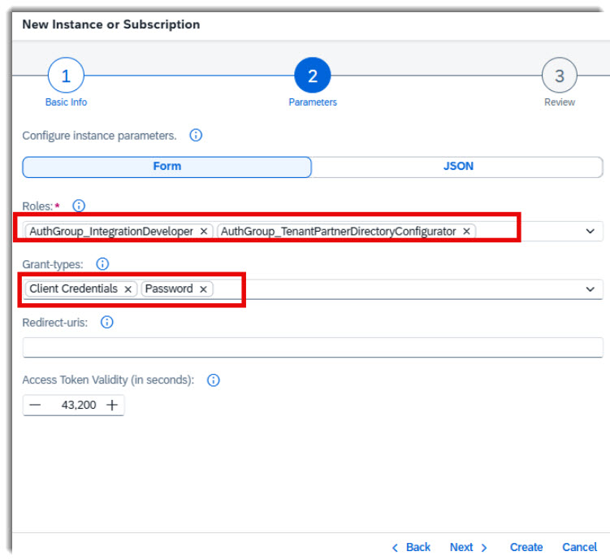
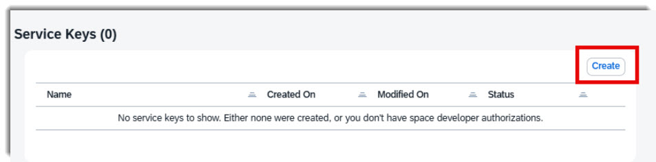
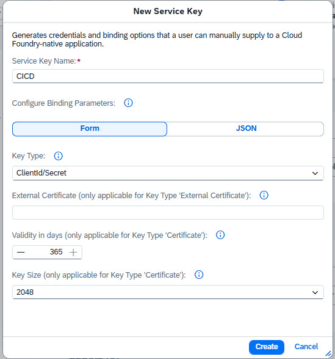
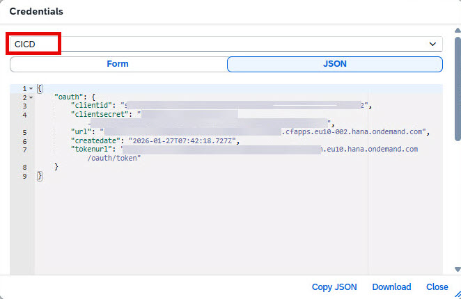

# Create Service Key

This guide explains how to create a service key that allows GitHub Workflows to interact with BTP APIs.

> **Note:** Repeat these steps for every tenant in your landscape (DEV, TST, PRD).

---

## 📋 Prerequisites

- Access to SAP BTP Cockpit
- Permissions to create service instances and keys in your subaccount

---

## 🔧 Step-by-Step Instructions

### Step 1: Create a New Service Instance

Navigate to your subaccount in the BTP Integration Suite and click **Create**.

### Step 2: Select the Service

Select **SAP Process Integration Runtime** from the service list.

### Step 3: Configure Instance Details

Provide the following details:
- **Plan**: Select the appropriate plan
- **Space**: Choose your target space
- **Instance Name**: Enter a meaningful name for the instance

### Step 4: Assign Roles

Select the required roles. If you are using access policies with a technical user (see [create-technical-user.md](create-technical-user.md)), make sure to also add **Password Grant**. Then click **Create** to create the instance.

### Step 5: Create the Service Key

Navigate to your newly created instance and click **Create Service Key**.

### Step 6: Name the Service Key

Enter a name for your service key and click **Create**.

### Step 7: Copy the Credentials

Copy the JSON content of the service key. You will need this for configuring the GitHub Workflows.

---

## ✅ Next Steps

After creating the service key, store the JSON credentials securely. These will be used to configure the GitHub repository secrets for authenticating with the BTP APIs.