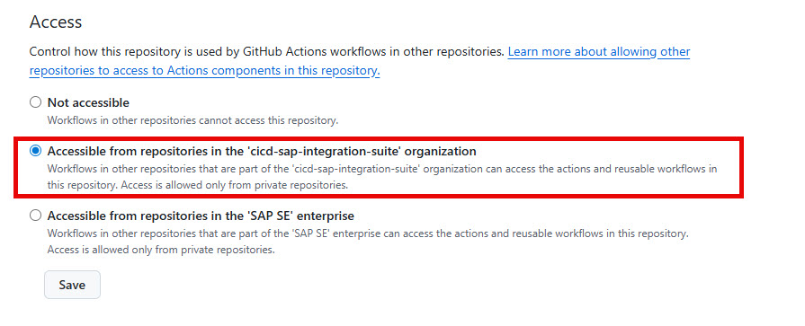

## 📁 Repository Setup

Prepare a new repository to contain the cicd-actions.

## 🔄 Synchronizing Content from SAP Repository

To synchronize content from [https://github.com/SAP/cicd-actions-for-sap-integration-suite](https://github.com/SAP/cicd-actions-for-sap-integration-suite) into your `cicd-actions` repository, you need to transfer the `.github` folder from the SAP repository.

### What Will Be Synchronized

The `.github` folder from the SAP repository contains:

- **`.github/actions/`** - Reusable composite actions:
  - `get-token/` - Authentication handling
  - `download-package/` - Download integration packages
  - `deploy-package/` - Deploy packages to runtime
  - `git-commit/` - Git operations
  - `update-runtime/` - Runtime updates
  - And many more utility actions...

- **`.github/workflows/`** - Workflow templates:
  - `analyze-changes.yml`
  - `delete-dir-from-git.yml`
  - `delete-upload.yml`
  - `download-btp-to-git.yml`
  - `update-externalized-iflow-parameters.yml`

### Synchronization Methods

You can use one of the following methods to synchronize the `.github` folder:

- **Git CLI**: Use the command line to clone, fetch, or pull the relevant content from the SAP repository. This is the recommended approach for most users, as it provides full control and traceability.
- **GitHub Desktop**: Use the GitHub Desktop application to clone repositories and manage file transfers via a graphical interface.
- **Manual Download**: Download the repository as a ZIP file from GitHub, extract the `.github` folder, and copy it to your repository. This method is not recommended for ongoing maintenance or synchronization.

> ⚠️ **Important**: After synchronizing, review any customizations you made to workflows or actions, as they may be overwritten during synchronization.

---

## ✅ Verification

After synchronization, verify your repository structure:

```
cicd-actions/
├── .github/
│   ├── actions/
│   │   ├── add-ids-for-deployment/
│   │   ├── add-iflows-for-deployment/
│   │   ├── check-partnerid-exists/
│   │   ├── ...
│   │   └── update-runtime/
│   └── workflows/
│       ├── analyze-changes.yml
│       ├── delete-dir-from-git.yml
│       ├── delete-upload.yml
│       ├── download-btp-to-git.yml
│       └── update-externalized-iflow-parameters.yml
└── ... (other repository files)
```

---

## 🔁 Keeping Content Up-to-Date

To stay synchronized with the latest changes from the SAP repository:

1. **Watch the repository** on GitHub to get notifications about updates.
2. **Periodically repeat** the synchronization steps using your chosen method.
3. **Review release notes** for any breaking changes before updating.

> ⚠️ **Important**: After updating, review any customizations you made to workflows or actions, as they may be overwritten during synchronization.

---

## 🔒 Action Permissions

After synchronizing and verifying your repository structure, configure GitHub Action permissions:

1. Go to your repository on GitHub: `cicd-actions`.
2. Navigate to **Settings** > **Actions** > **General**.
3. In the **Workflow permissions** section, ensure that you **Allow access to actions from other repositories**. (The description may vary between GitHub Enterprise Cloud and GitHub Enterprise Server.)



> ⚠️ **Important**: This setting is required for workflows to use actions defined in external repositories, such as those from the cicd-actions repository.

---