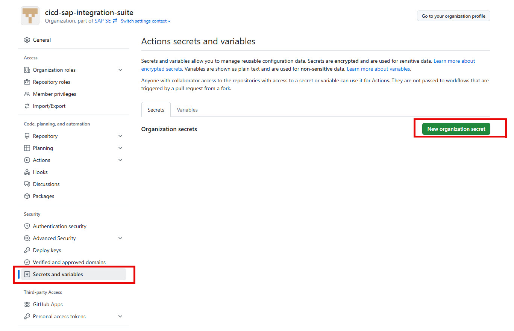
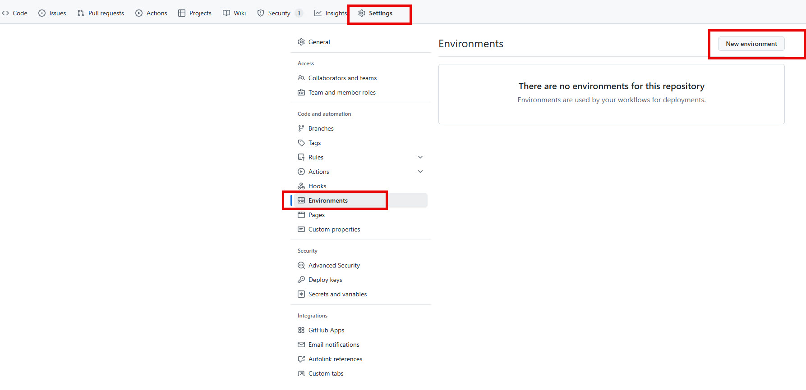
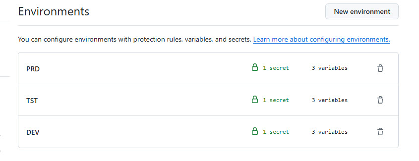
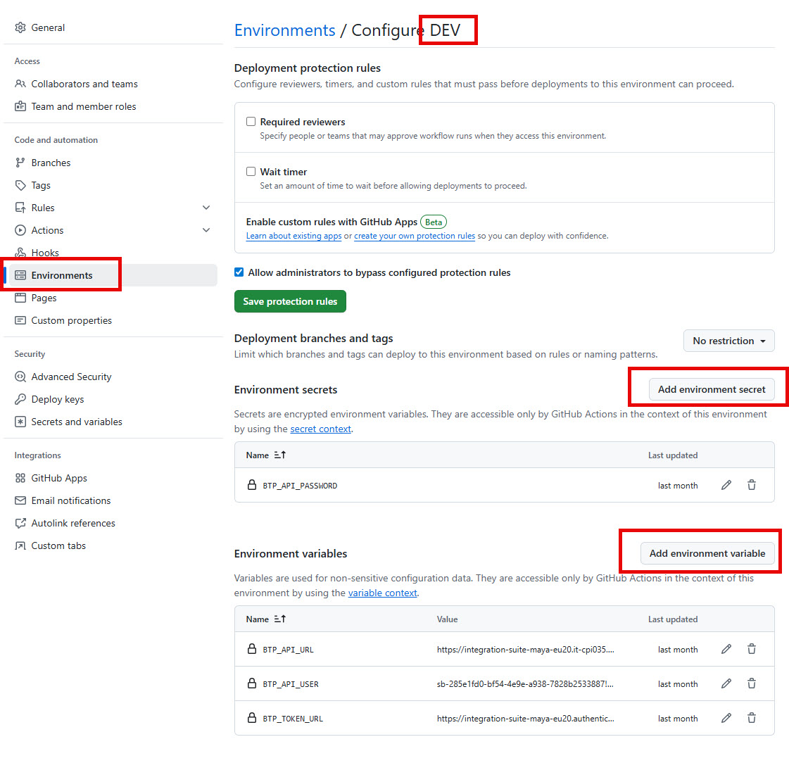

# Setup GIT Environment

After all necessary credentials have been created, the needed GIT environment configuration can be done. It is differentiated into 3 main areas:

- Organizational global variables & secrets
- Repository global variables & secrets
- Environment specific variables & secrets

Find below a section for each area that you need to setup in your repository:

- [Organizational Variables & Secrets](#organizational-variables--secrets)
- [Repository Global Variables & Secrets](#repository-global-variables--secrets)
- [Environment Specific Variables & Secrets](#environment-specific-variables--secrets)

## Organizational Variables & Secrets

Go to your organization → **Settings**

And from there to → **Secrets and variables**

Maintain the following variables and secrets:

| Type     | Name                | Value                                 |
|----------|---------------------|---------------------------------------|
| Variable | BTP_ADMIN_TEAM_SLUG | cicd_release_manager                  |
| Variable | BTP_DEV_TEAM_SLUG   | cicd_developer                        |
| Variable | GIT_CICD_ORGREPO    | \<yourorg>/\<cicd-actions>            |
| Variable | RUNS_ON             | \<runners version e.g. ubuntu-latest> |
| Secret   | GIT_CICD_TOKEN      | \<insertyourtoken>                    |
| Secret   | GIT_ORG_TOKEN       | \<insertyourtoken>                    |

## Repository Global Variables & Secrets

Currently no repository global variables or secrets required.

## Environment Specific Variables & Secrets

In your newly created repository `cicd-intsuite`, create 3 environments: **DEV**, **TST** and **PRD**.

After creation:

For each environment, maintain the specific variables & secrets as shown in the table below the screenshot:

| Type     | Name             | Value                                            |
|----------|------------------|--------------------------------------------------|
| Variable | BTP_API_URL      | \<URL from service key JSON DEV>                 |
| Variable | BTP_API_USER     | \<clientid from service key JSON DEV>            |
| Variable | BTP_TEC_USER     | \<dev tec user> (leave empty if not needed)      |
| Variable | BTP_TOKEN_URL    | \<URL from service key JSON DEV>                 |
| Secret   | BTP_API_PASSWORD | \<clientsecret from service key JSON DEV>        |
| Secret   | BTP_TEC_PASSWORD | \<dev tec user password> (leave empty if not needed) |